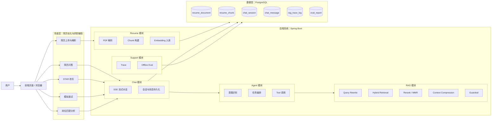
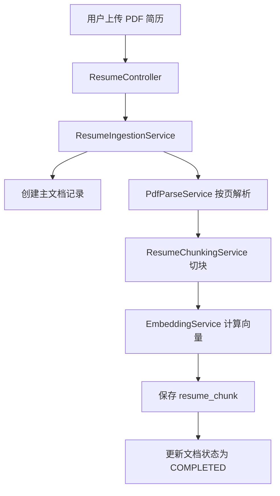
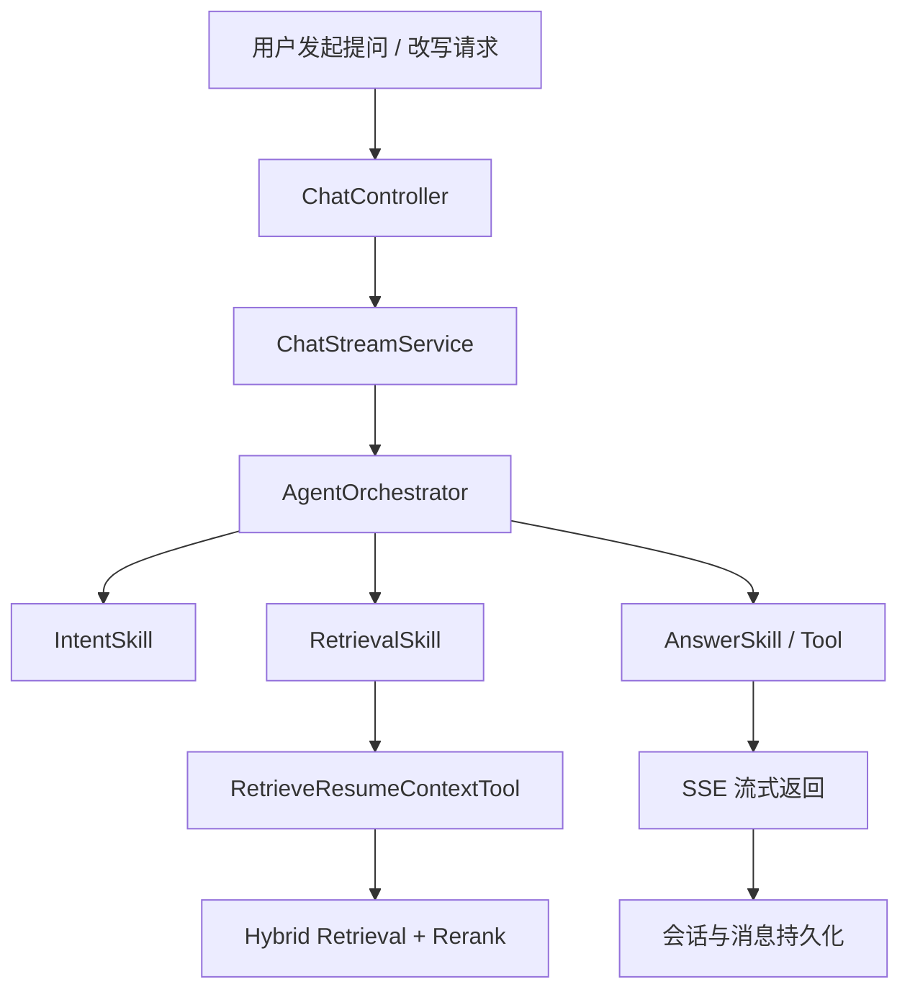

# ResumeCoachAgent

基于 `Spring Boot + Spring AI + RAG + Agent` 的智能简历教练系统。  
项目以上层“简历优化与求职辅助”场景为核心，底层构建了可扩展的文档解析、检索增强、对话编排与评测能力。

---

## 1. 项目定位

本项目不是单纯的聊天系统，也不是只做一个简历上传工具，而是一个：

- 面向求职场景的智能简历教练系统
- 具备通用文档型 `RAG / Agent / Chat` 底座能力的后端系统

当前主要围绕以下场景展开：

- 简历上传与解析
- 简历问答
- STAR 改写
- 模拟面试
- 岗位匹配分析

---

## 2. 当前已实现功能

### 2.1 简历上传与知识化入库

- 支持 PDF 简历上传
- 支持按页文本抽取与清洗
- 支持 Section 识别与 Parent-Child Chunk 切分
- 支持 Chunk 级 Embedding 预计算与入库

### 2.2 简历场景问答与改写

- 支持围绕简历内容的问答
- 支持 STAR 改写工具
- 支持模拟面试模式下的对话扩展

### 2.3 RAG 检索增强

- 支持关键词、全文检索、向量检索结合的混合召回
- 支持 Query Rewrite、Multi-Query 扩展
- 支持 Rerank、MMR 去冗余、上下文压缩
- 支持 Parent-Child 回填与证据组织

### 2.4 Agent 编排与流式交互

- 支持意图识别与技能分流
- 支持 Tool 调用与统一答案编排
- 支持 SSE 流式输出
- 支持会话与消息持久化

### 2.5 质量保障与工程能力

- 支持 Citation 校验
- 支持无证据降级策略
- 支持 Trace 日志记录
- 支持 Offline Eval 离线评测

---

## 3. 核心技术栈

### 后端与基础设施

- Java 17
- Spring Boot 3
- Maven
- PostgreSQL
- Docker

### AI 与检索

- Spring AI
- RAG
- Embedding
- Hybrid Retrieval
- Rerank / MMR

### 文档处理与交互

- PDFBox
- SSE

---

## 4. 系统分层

### 场景层

围绕简历优化与求职辅助提供业务能力：

- 简历上传与解析
- 简历问答
- STAR 改写
- 模拟面试
- 岗位匹配分析

### 底座层

为上层场景提供通用能力：

- 文档解析与清洗
- Chunk 构建与 Embedding
- RAG 检索增强
- Agent 编排
- Chat 与流式输出
- Trace 与 Eval

---

## 5. 系统结构图

这张图对应项目当前的“双层结构”：

- 上层是面向用户的简历优化场景能力
- 下层是支撑这些场景的文档解析、RAG、Agent、Chat 与评测底座

---

## 6. 核心流程

### 6.1 简历上传入库

### 6.2 问答与改写主链路

---

## 7. 主要模块

- `resume`：简历上传、解析、切块、入库
- `chat`：会话管理、消息持久化、SSE 流式输出
- `agent`：意图识别、任务编排、工具调用
- `rag`：检索、重排序、上下文压缩、Guardrail
- `observability`：Trace 记录与查询
- `eval`：离线评测与结果分析

---

## 8. 当前项目特点

相比普通的“大模型问答 Demo”，本项目更强调工程化能力：

- 不是直接把问题丢给模型，而是基于简历证据进行回答
- 不是只做单轮对话，而是具备会话、消息和流式交互能力
- 不是只关注功能实现，还考虑了引用校验、可观测性和评测闭环
- 上层聚焦简历场景，下层保留通用文档型 Agent/RAG 扩展能力

---

## 9. 后续规划

### 9.1 简历场景增强

- 简历结构化抽取（项目名、技术栈、职责、成果）
- JD 匹配分析
- 项目亮点提炼
- 自我介绍生成
- 面试追问与回答点评

### 9.2 Chat / Memory 升级

- 短期记忆
- 长期记忆
- Memory RAG

### 9.3 RAG 底座升级

- Elasticsearch 检索底座
- OCR 与版面分析
- 更强的 Chunk 结构化切分
- GraphRAG 高阶探索

### 9.4 工程化升级

- 更完整的评测体系
- 更细粒度的可观测性
- 安全与鲁棒性增强
- 异步任务化处理链路

---

## 10. 文档索引

项目文档已整理到 `docs/` 目录下，根目录索引见：

- [DOCS_INDEX.md](./DOCS_INDEX.md)

其中主要包括：

- 开题报告相关文档
- 项目规划与升级路线
- 系统结构与接口规范

---

## 11. 适用说明

本项目当前更适合作为：

- 毕业设计项目
- 简历项目展示
- 文档型 RAG / Agent 系统实践样例

后续也可以在现有底座基础上扩展到其他文档场景，但当前主线始终以“简历优化与求职辅助”为核心。
